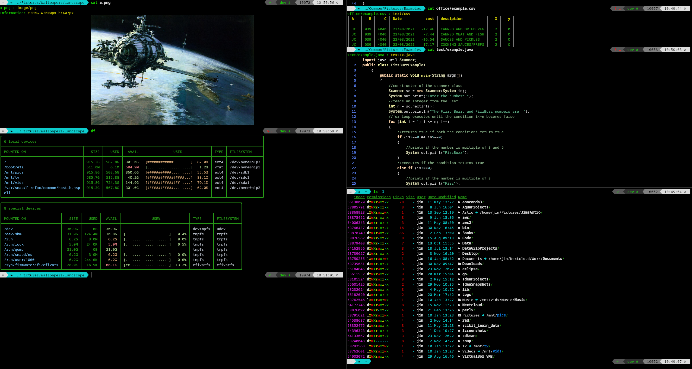

```
 ____        _   _____ _ _
|  _ \  ___ | |_|  ___(_| | ___ ___
| | | |/ _ \| __| |_  | | |/ _ / __|
| |_| | (_) | |_|  _| | | |  __\__ \
|____/ \___/ \__|_|   |_|_|\___|___/
```

[](https://github.com/jimcornmell/dotfiles/blob/master/LICENSE)
[](https://github.com/jimcornmell/dotfiles)

Here is my Linux command line setup.  I have various tools which are setup and
ready to use.  Feel fee to plagiarize my configuration (I have!).



# Zsh, oh-my-zsh and Powerlevel 10k
I use zsh and most of my configuration is in [`.zshrc`](https://github.com/jimcornmell/dotfiles/blob/main/.zshrc).

Like many others I tailor the look and feel of zsh
using [Oh My Zsh](https://ohmyz.sh), also using
[Powerlevel10k](https://github.com/romkatv/powerlevel10k).

# Editor Neovim/LunarVim
I mostly use the brilliant [LunarVim](https://github.com/ChristianChiarulli/LunarVim).

# Theming - Zenburn
I've used [Zenburn](https://github.com/jnurmine/Zenburn) for years now. One of
the reasons I like it, is that it has been ported to most tools that support
theming. So in the list that follows I've setup zenburn to be the theme used.

# Tools
Here is a list of tools that I use and highly recommend.
I usually alias these to replace the traditional tools, so for example `eza` becomes `ls` and `duf` becomes `df` (note you can always use the original command if you just prefix with a backslash, i.e. `\ls`)

Name                                                      | Description
--------------------------------------------------------- | -------------------------------------
[ag](https://geoff.greer.fm/ag/)                          | Find replacement.
[Bat](https://github.com/sharkdp/bat)                     | Cat with wings!
[bpyttop](https://github.com/aristocratos/bpytop)         | top/htop replacement. System monitor.
[cht](https://github.com/chubin/cheat.sh)                 | Man page replacement.
[delta](https://github.com/dandavison/delta)              | Diff replacement, integrates well with git.
[duf](https://github.com/muesli/duf)                      | df replacement.
[Eza](https://eza.rocks)                                  | ls on steroids (was exa)
[fd](https://github.com/sharkdp/fd)                       | Find replacement.
[fzf](https://github.com/junegunn/fzf)                    | Fuzzy finder
[glances](https://github.com/nicolargo/glances)           | top/htop replacement. System monitor.
[gping](https://github.com/orf/gping)                     | Ping replacement.
[httpie](https://httpie.io)                               | curl replacement.
[jq](https://github.com/jqlang/jq)                        | Viewing JSON files, although see lion below.
[Jump](https://github.com/wting/autojump)                 | Jump to directories
[Kitty](https://sw.kovidgoyal.net/kitty/)                 | Command terminal, very powerful and configurable.
[Lunarvim](https://github.com/LunarVim/LunarVim)          | config and setup for Neovim.
[ncdu](https://dev.yorhel.nl/ncdu)                        | Disc usage, but nice!
[Neovim](https://github.com/neovim/neovim)                | Editor.
[Oh My Zsh](https://github.com/ohmyzsh/ohmyzsh)           | Community-driven framework for managing your zsh configuration.
[prettyping](https://github.com/denilsonsa/prettyping)    | ping replacement. Ping but nicer!
[Ranger](https://github.com/ranger/ranger)                | Terminal file browser.
[rmtrash](https://github.com/PhrozenByte/rmtrash)         | Recycle files.
Terminal Multiplexer                                      | I used [tmux](https://github.com/tmux/tmux) for a while but when I moved over to kitty this became redundant.
[tldr](https://github.com/tldr-pages/tldr)                | Man page replacement.

You can find many nice replacements, here is a page with some examples: https://github.com/ibraheemdev/modern-unix

# Lion/Lioness
I've taken [rangers scope.sh](https://github.com/ranger/ranger/blob/master/ranger/data/scope.sh) script and ran with it a little, basically I've created two shell scripts which act as a wrapper for scope and used these as an alias for cat and less.

My [scope.sh is here](https://github.com/jimcornmell/dotfiles/blob/main/bin/scope.sh).

This basically means if I cat a file it will run the scope script which will decide which tool is best to display the file in the terminal.  So if you run `cat file.ext` it will use the extension/mimetype/etc to choose as in the following table.

Extension/filetype             | Tool used to display that file.
-------------------------------| -------------------------------------
csv/tsv/spreadsheet            | [Tabulate](https://pypi.org/project/tabulate/)
fonts                          | [fontimage from fontforge](https://fontforge.org/docs/fontutils/fontimage.html)
html                           | [w3m](https://w3m.sourceforge.net/)
images                         | [icat kitten in kitty](https://sw.kovidgoyal.net/kitty/kittens/icat/)
json                           | [jq](https://github.com/jqlang/jq)
md/Markdown                    | [mdcat](https://github.com/swsnr/mdcat)

Note this list is not exhaustive.

# Key bindings (for Kitty)

Key                  | Action
-------------------- | ---------------------------------------------------------------------------------------
`<Shift+F1>`         | Toggle highlighting in Red of error, fatal, failed and exception.
`<Shift+F2>`         | Toggle highlighting in Orange or warn and warning.
`<Shift+F3>`         | Toggle highlighting in Green of info and information.
`<Shift+F4>`         | All 3 groups above are highlighted.
`<Alt+\>`            | Split the terminal vertically.
`<Alt+->`            | Split the terminal horizontally.
`<F5>`               | Open file under cursor, e.g. if any command outputs a file name, point at it in the terminal and hit `<F5>`.
`<F10>`              | Open a new terminal in a tab below.
`<Ctrl+Shift+Left>`  | Move to left terminal tab.
`<Ctrl+Shift+Right>` | Move to right terminal tab.
