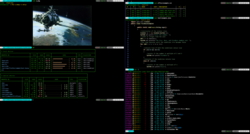
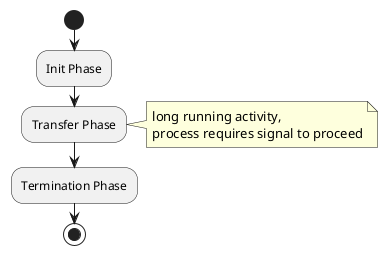

# [Markdown Syntax](https://www.jetbrains.com/help/hub/Markdown-Syntax.html)
* **Strong** or __Strong__, *Emphasis* or _Emphasis_, ~~Strikethrough~~ and `Some Code`

```
A block
of code
```

- bullet 1
- bullet 2

1. num 1
1. num 2
1. num 3

|    Month | Assignee | Backup |
|---------:|:--------:|--------|
|  January |   Dave   | Steve  |
|    March |  Diane   | Jorge  |

* [inline link](https://www.jetbrains.com)
* [inline link with tooltip](https://www.jetbrains.com "JetBrains: Development Tools for Professionals and Teams")
* [reference link][1]




___

```plantuml
digraph g {
  fontname="Helvetica,Arial,sans-serif"
  node [fontname="Helvetica,Arial,sans-serif"]
  edge [fontname="Helvetica,Arial,sans-serif"]
  graph [fontsize=30 labelloc="t" label="" splines=true overlap=false rankdir = "LR"];
  ratio = auto;

  "state0" [ style = "filled, bold" penwidth = 5 fillcolor = "white" fontname = "Courier New" shape = "Mrecord" label =<<table border="0" cellborder="0" cellpadding="3" bgcolor="white"><tr><td bgcolor="black" align="center" colspan="2"><font color="white">State #0</font></td></tr><tr><td align="left" port="r0">&#40;0&#41; s -&gt; &bull;e $ </td></tr><tr><td align="left" port="r1">&#40;1&#41; e -&gt; &bull;l '=' r </td></tr><tr><td align="left" port="r2">&#40;2&#41; e -&gt; &bull;r </td></tr><tr><td align="left" port="r3">&#40;3&#41; l -&gt; &bull;'*' r </td></tr><tr><td align="left" port="r4">&#40;4&#41; l -&gt; &bull;'n' </td></tr><tr><td align="left" port="r5">&#40;5&#41; r -&gt; &bull;l </td></tr></table>> ];

  "state5" [ style = "filled" penwidth = 1 fillcolor = "/blues4/1:/blues4/3" fontname = "Courier New" shape = "Mrecord"
  label =<<table border="0" cellborder="0" cellpadding="3" ><tr><td align="center" colspan="2"><font color="white">State #5</font></td></tr><tr><td align="left" port="r0"><font color="white">&#40;0&#41; s -&gt; e &bull;$ </font></td></tr></table>> ];

  state0 -> state5 [ penwidth = 5 fontsize = 28 fontcolor = "black" label = "e" ];

}
```
____

```plantuml
digraph g {
    fontname="Arial"
    node [fontname="courier" fontsize=12 style="filled, bold, rounded" penwidth=1 fillcolor = "/blues4/1:/blues4/3" shape="none"];
    edge [fontname="courier" fontsize=8]
        graph [fontsize=20 labelloc="top" label="Some Label" splines=true overlap=false rankdir = "LR"];
    ratio = auto;

    wibblewobbleparent [label=<<table border='0'><tr><td port='wibblelib'><font color='red'>Library</font></td></tr><tr><td port='wibblemaths'>Maths</td></tr></table>>];
    print_lib_print_common_parent [label=<<table border='0'><tr><td port='print_common_lib'><font color='red'>Printing</font></td></tr><tr><td port='print_common_lib'>Maths</td></tr></table>>];
    cve_234_1234 [fillcolor="/reds4/1:/reds4/3" fontname="courier" label=<
      <table border="0">
          <tr><td>CVE-234-9999</td><td>7.5</td></tr>
          <tr><td>CVE-234-9999</td><td>7.5</td></tr>
      </table>
>];

    Wibble -> print_lib_print_common_parent:print_common_maths
    Wibble -> wibblewobbleparent:wibblelib
    Wibble -> wibblewobbleparent:wibblemaths
    print_lib_print_common_parent:print_common_maths -> cve_234_1234
}
```
___
[1]: https://www.jetbrains.com
